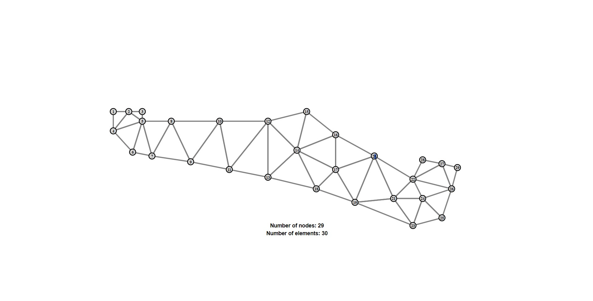

# Finite Element Grid Web Drawer

## Project Overview
The goal of this project is to develop a web application for drawing a finite element grid based on the data from the `nodes` and `elements` tables of the `femdb` database.



### Key Features
- **HTTP**: The application uses the HTTP protocol for communication between the client and the server. This allows the application to be accessed through a web browser.
- **Structured Programming**: The code is written using structured programming principles for better readability and maintainability.
- **MVC**: The application follows the Model-View-Controller (MVC) design pattern, separating the database operations, SVG generation, and HTTP handling.
- **Database Integration**: The application integrates with a database to retrieve the data needed to generate the finite element grid.
- **SVG Generation**: The application generates an SVG representation of the finite element grid, which can be easily displayed in a web browser.
- **Configuration Files**: The application uses configuration files to store settings for the database and server, making it easy to adjust these settings without modifying the code.

## Installation and Running
1. Clone the repository:
```bash
git clone https://github.com/aagavrish/feg-web-drawer.git
cd feg-web-drawer
```

2. Configure the server and database settings. The configuration files are located in the configs directory and are named `server.json` and `database.json` respectively. In these files, you can specify the connection parameters for the server and database.

3. Run the `./build/run.sh` script to build and start the Docker container. This script will first build a Docker image from the application, and then run it in a new container.

## System and Utility Requirements
- **Operating System:** Compatible with any operating system that supports Docker.
- **Libraries:** Required for building the application are the standard Go library and the following additional libraries:
    1. SVG generation: "github.com/ajstarks/svgo"
    2. Go MySQL driver: "github.com/go-sql-driver/mysql"
- **Docker:** For building and running the application in any environment.
- **Git**: For version control management.

## Additional Information

### License

This project is licensed under the MIT License. See the LICENSE file for details.

### Contact

If you have any questions, issues, or suggestions, please feel free to open an issue in the repository or contact me on Telegram at `aagavrish`.